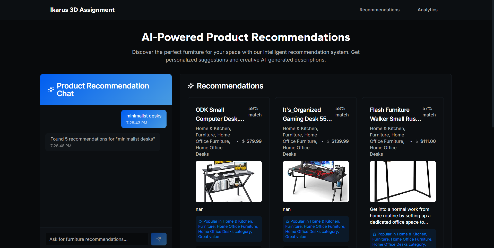
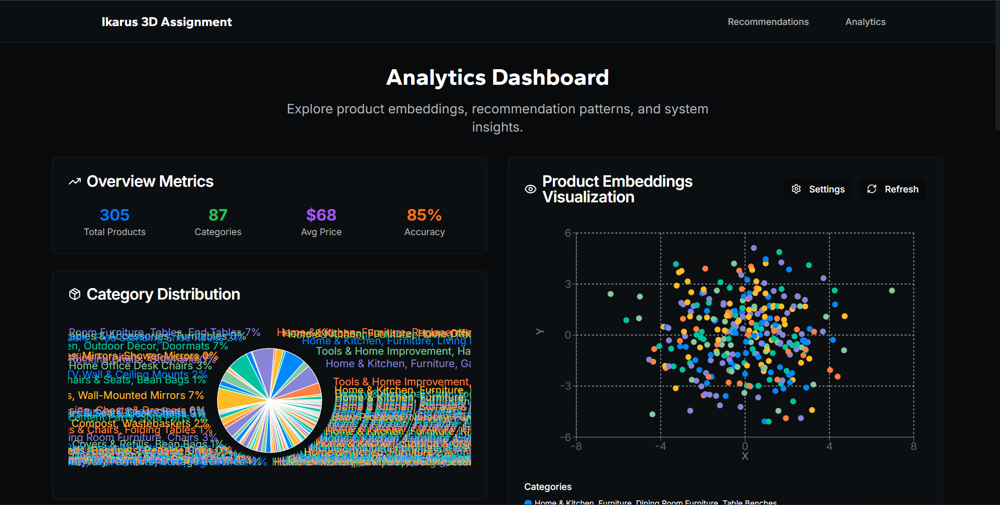

# Product Recommendation/Analytics Web App

A small, end‑to‑end web app that recommends furniture products, groups similar items, and generates short creative descriptions. It includes a chat‑style recommendations page and a separate analytics page.

**Aaditya Salaria | 102218064**

## What’s inside
- **Backend**: FastAPI + embeddings + simple ML/NLP/CV flows
- **Frontend**: React (Next.js) with a chat UI and an analytics route
- **Vector DB**: Pinecone for semantic search over text/image embeddings
- **GenAI**: Lightweight model to write creative product blurbs
- **Integration**: LangChain for embedding/LLM plumbing

## Screenshots 
1) Recommendations page



2) Analytics page



## Quick start
Prereqs: Python 3.9+, Node 18+

Backend
```bash
cd backend
python -m venv venv
venv\Scripts\activate  # on Windows
pip install -r requirements.txt
copy .env.example .env  
uvicorn main:app --reload --host 0.0.0.0 --port 8000
```

Frontend
```bash
cd frontend
npm install
copy .env.example .env.local
npm run dev
```

Open: http://localhost:3000

## Routes (app UX)
- Chat recommendations: `/recommendations` (natural language, back‑and‑forth)
- Analytics dashboard: `/analytics` (dataset insights and visuals)

## Dataset
Columns provided:
- `title`, `brand`, `description`, `price`, `categories`, `images`, `manufacturer`, `package dimensions`, `country_of_origin`, `material`, `color`, `uniq_id`

Dataset link: `https://drive.google.com/file/d/1uD1UMXT2-13GQkb_H9NmEOyUVI-zKyl6/view?usp=sharing`

## Minimal configuration
Backend `.env` (example)
```env
PINECONE_API_KEY=your_key
PINECONE_ENVIRONMENT=us-east-1
PINECONE_INDEX_NAME=furniture-products
OPENAI_API_KEY=optional_if_used
EMBEDDING_MODEL=all-MiniLM-L6-v2
GENAI_MODEL=gpt2
```

Frontend `.env.local`
```env
NEXT_PUBLIC_API_URL=http://localhost:8000
```

## What’s required
1. **ML**: Build recommendations over the dataset 
2. **NLP**: Process text to group/find related products
3. **CV**: Classify product images into categories/types
4. **GenAI**: Generate short creative descriptions for recommended items
5. **Vector DB**: Store embeddings for semantic search (Pinecone)
6. **Frontend**: React chat to show recommendations with images + descriptions
7. **Analytics Page**: Separate route with dataset analytics/visuals
8. **Integration**: Use LangChain for GenAI/embedding flows

## Deliverables
- React frontend
- FastAPI backend
- Data analytics notebook (`models/notebooks/…`) with clear reasoning
- Model training notebook (`models/notebooks/…`) with reasoning and eval
- README

